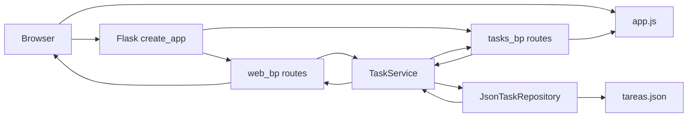
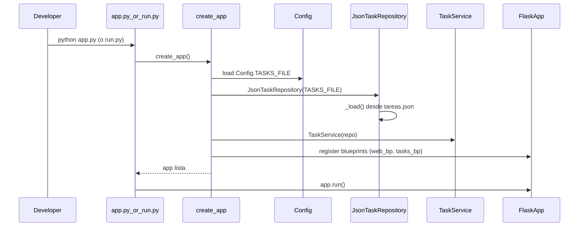
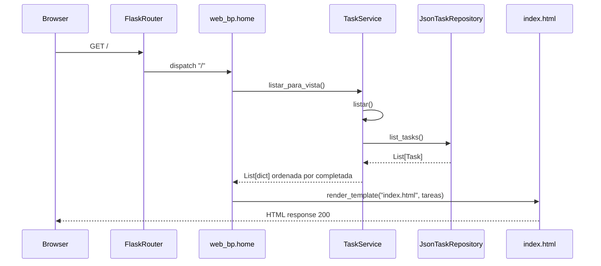
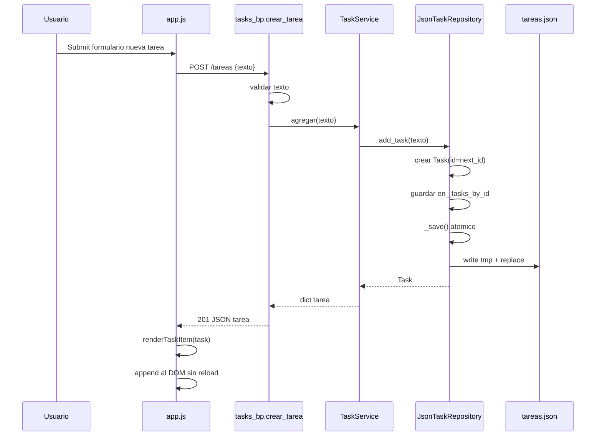
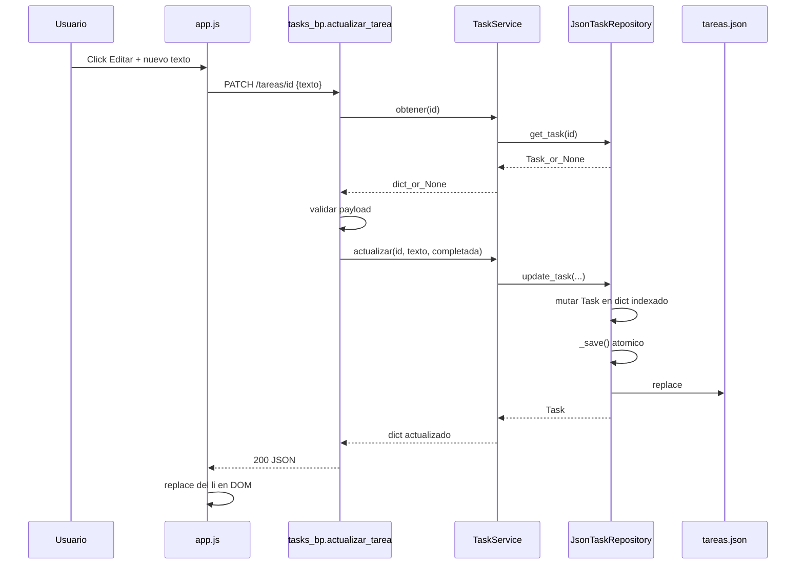
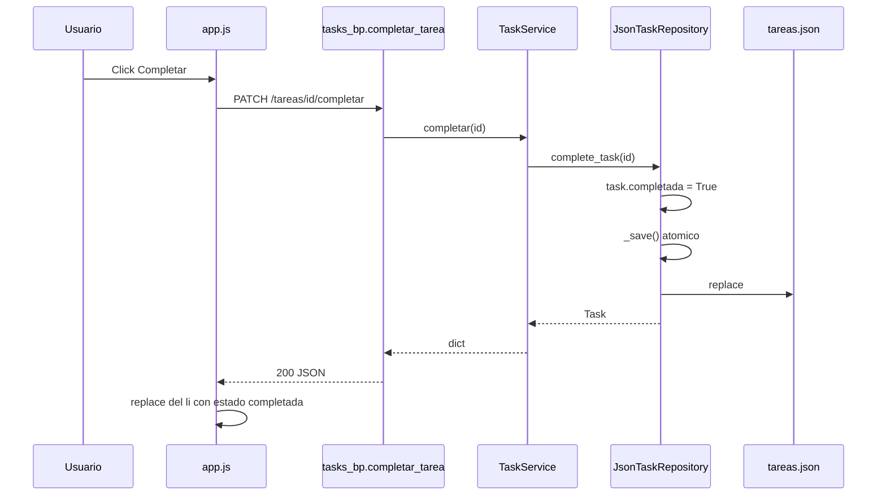
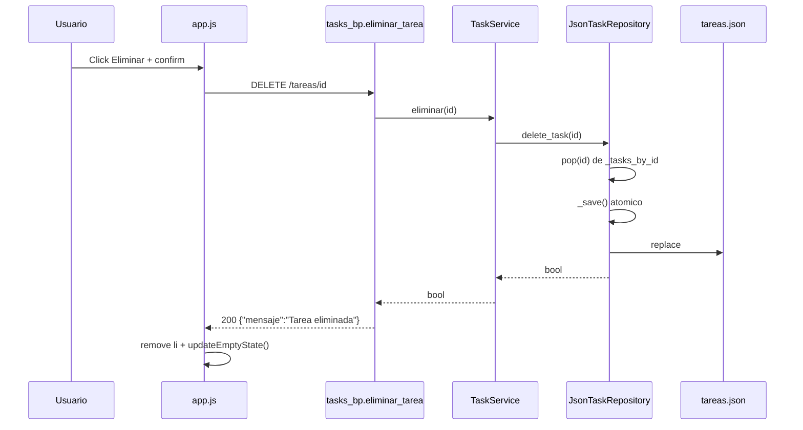

# Gestor de Tareas Flask

Aplicacion de tareas con CRUD, interfaz web y persistencia en archivo JSON.

## Requisitos

- Python 3.10+ (recomendado)

## Instalacion

```bash
python -m venv .venv
source .venv/bin/activate
pip install -r requirements.txt
```

## Ejecutar en desarrollo

```bash
python run.py
```

Tambien funciona:

```bash
python app.py
```

Abrir en navegador: `http://127.0.0.1:5000`

## Estructura

- `app/__init__.py`: factory Flask y registro de blueprints.
- `app/routes/web.py`: vistas HTML.
- `app/routes/tasks.py`: API REST de tareas.
- `app/services/task_service.py`: logica de negocio.
- `app/repositories/json_task_repository.py`: persistencia JSON (atomica y con lock).
- `templates/index.html`: UI.
- `static/js/app.js`: interacciones frontend sin recargar pagina.

## Variables de entorno

- `TASKS_FILE`: ruta del archivo JSON para persistencia (default: `tareas.json`).

Ejemplo:

```bash
TASKS_FILE=/tmp/mis_tareas.json python run.py
```

## Tests

```bash
pytest -q
```

## Flujos de la aplicacion

### Endpoints API

| Metodo | Ruta | Descripcion | Body esperado | Respuesta |
| --- | --- | --- | --- | --- |
| `GET` | `/` | Renderiza la vista principal HTML | - | `200` HTML |
| `GET` | `/tareas` | Lista todas las tareas | - | `200` JSON array |
| `GET` | `/tareas/{id}` | Obtiene una tarea por id | - | `200` JSON / `404` error |
| `POST` | `/tareas` | Crea una nueva tarea | `{"texto":"..."}` | `201` JSON / `400` error |
| `PATCH` | `/tareas/{id}` | Actualiza texto y/o estado | `{"texto":"..."}` o `{"completada":true}` | `200` JSON / `400` / `404` |
| `PUT` | `/tareas/{id}` | Actualiza texto y/o estado | `{"texto":"..."}` o `{"completada":true}` | `200` JSON / `400` / `404` |
| `PATCH` | `/tareas/{id}/completar` | Marca una tarea como completada | - | `200` JSON / `404` error |
| `DELETE` | `/tareas/{id}` | Elimina una tarea | - | `200` JSON / `404` error |

### Arquitectura general



### Arranque de la app



### Flujo de pagina inicial



### Crear tarea (POST /tareas)



### Actualizar tarea (PATCH /tareas/{id})



### Completar tarea (PATCH /tareas/{id}/completar)



### Eliminar tarea (DELETE /tareas/{id})


